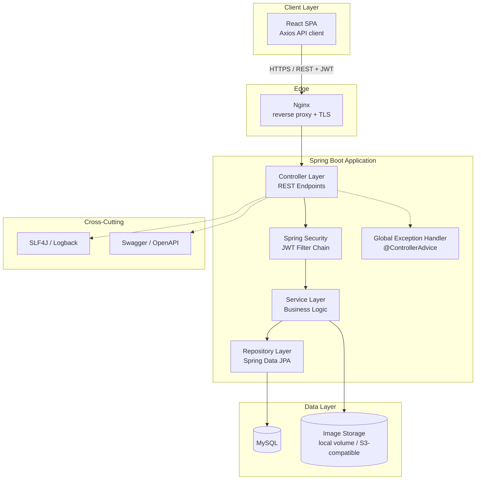
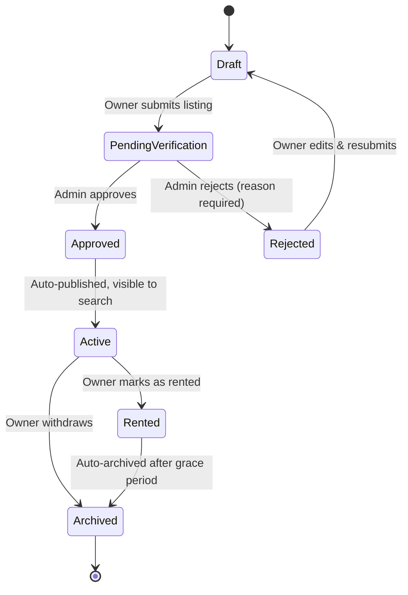
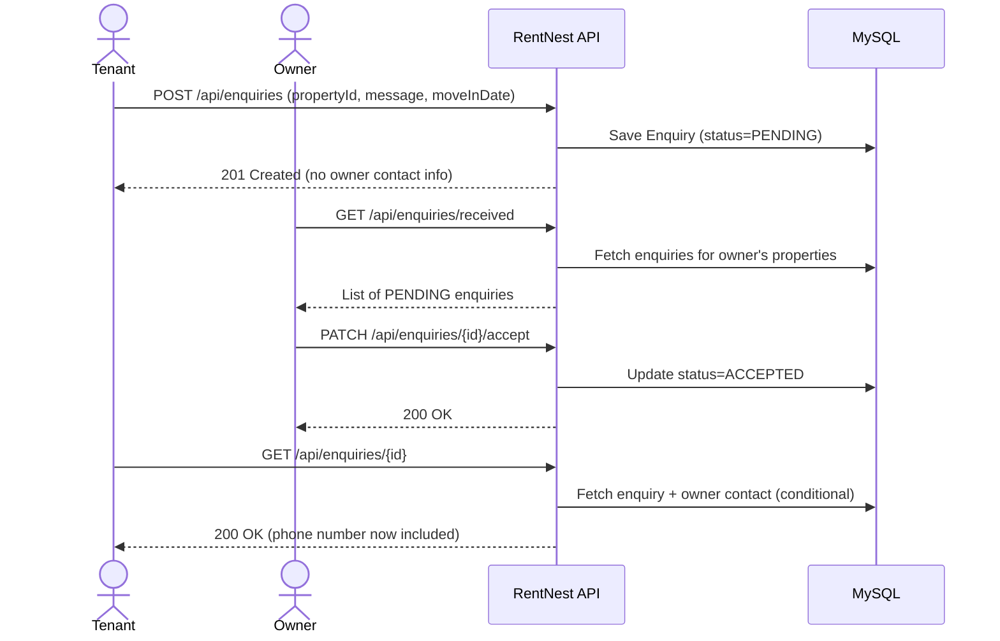
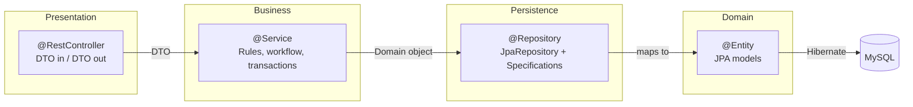
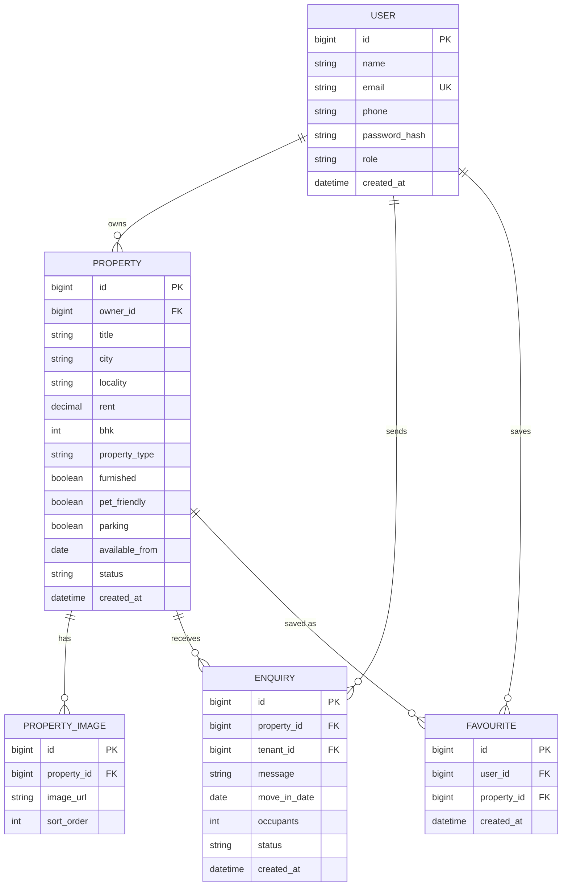
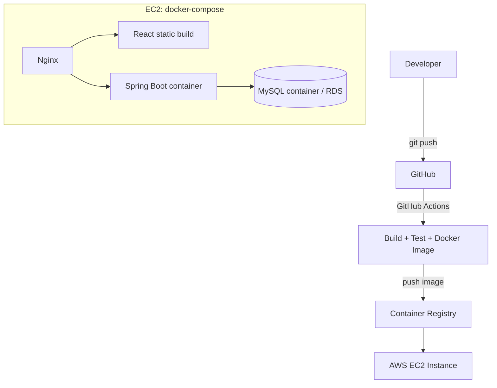

# Architecture.md — RentNest Technical Architecture

---

## 1. Tech Stack

| Layer | Technology |
|---|---|
| Frontend | React.js, HTML5, CSS3, Tailwind CSS, Axios |
| Backend | Java 21, Spring Boot, Spring MVC, Spring Security, Spring Data JPA (Hibernate) |
| Auth | JWT (stateless), BCrypt |
| Database | MySQL 8 |
| API Docs | Swagger / OpenAPI 3 (springdoc-openapi) |
| Build | Maven (backend), npm/Vite (frontend) |
| Testing | JUnit 5, Mockito |
| Tooling | Git, GitHub, Postman, Docker |
| Deployment | Docker Compose → AWS EC2 + Nginx, GitHub Actions CI/CD |
| Future | Redis (cache), Elasticsearch (search), Kafka/RabbitMQ (notifications), Spring Cloud (microservices) |

---

## 2. High-Level System Architecture



---

## 3. Property Lifecycle (State Machine)

This is the core workflow that elevates the project beyond basic CRUD.



---

## 4. Enquiry Workflow (Sequence Diagram)



---

## 5. Layered Backend Architecture



**Rule:** Entities never cross into the Controller layer directly — every request/response uses a DTO (see Rules.md §Data Boundaries). Mapping happens in the Service layer (manually or via MapStruct).

---

## 6. Entity-Relationship Diagram



---

## 7. Backend Folder Structure

```
rentnest-backend/
├── src/main/java/com/rentnest/
│   ├── RentNestApplication.java
│   ├── config/
│   │   ├── SecurityConfig.java
│   │   ├── SwaggerConfig.java
│   │   ├── CorsConfig.java
│   │   └── JwtConfig.java
│   ├── controller/
│   │   ├── AuthController.java
│   │   ├── PropertyController.java
│   │   ├── SearchController.java
│   │   ├── EnquiryController.java
│   │   ├── FavouriteController.java
│   │   ├── DashboardController.java
│   │   └── AdminController.java
│   ├── service/
│   │   ├── AuthService.java
│   │   ├── PropertyService.java
│   │   ├── SearchService.java
│   │   ├── EnquiryService.java
│   │   ├── FavouriteService.java
│   │   ├── ImageStorageService.java
│   │   └── impl/
│   ├── repository/
│   │   ├── UserRepository.java
│   │   ├── PropertyRepository.java
│   │   ├── PropertySpecification.java
│   │   ├── EnquiryRepository.java
│   │   └── FavouriteRepository.java
│   ├── entity/
│   │   ├── User.java
│   │   ├── Property.java
│   │   ├── PropertyImage.java
│   │   ├── Enquiry.java
│   │   └── Favourite.java
│   ├── dto/
│   │   ├── request/
│   │   └── response/
│   ├── security/
│   │   ├── JwtAuthFilter.java
│   │   ├── JwtTokenProvider.java
│   │   └── UserDetailsServiceImpl.java
│   ├── exception/
│   │   ├── GlobalExceptionHandler.java
│   │   ├── ResourceNotFoundException.java
│   │   └── UnauthorizedActionException.java
│   └── util/
├── src/main/resources/
│   ├── application.yml
│   ├── application-docker.yml
│   └── db/migration/          # Flyway scripts (V1__init.sql, ...)
├── src/test/java/com/rentnest/
├── Dockerfile
└── pom.xml
```

## 8. Frontend Folder Structure

```
rentnest-frontend/
├── src/
│   ├── main.jsx
│   ├── App.jsx
│   ├── api/
│   │   ├── axiosClient.js
│   │   ├── authApi.js
│   │   ├── propertyApi.js
│   │   └── enquiryApi.js
│   ├── assets/
│   │   ├── fonts/
│   │   └── illustrations/       # hand-drawn SVG motifs (see Design.md)
│   ├── components/
│   │   ├── layout/              # Navbar, Footer, PageShell
│   │   ├── property/            # PropertyCard, PropertyGallery, FilterPanel
│   │   ├── enquiry/              # EnquiryForm, EnquiryStatusBadge
│   │   ├── dashboard/
│   │   └── ui/                  # Button, Input, Modal, AnnotationUnderline
│   ├── pages/
│   │   ├── Home.jsx
│   │   ├── Search.jsx
│   │   ├── PropertyDetail.jsx
│   │   ├── CreateListing.jsx
│   │   ├── OwnerDashboard.jsx
│   │   ├── TenantDashboard.jsx
│   │   ├── AdminReview.jsx
│   │   └── Auth/ (Login.jsx, Register.jsx)
│   ├── context/
│   │   └── AuthContext.jsx
│   ├── hooks/
│   ├── styles/
│   │   ├── tokens.css           # design tokens: color, type, spacing (see Design.md)
│   │   └── index.css
│   └── utils/
├── public/
├── tailwind.config.js
└── package.json
```

## 9. Deployment Architecture



`docker-compose up` starts three services: `frontend`, `backend`, `db`. Nginx sits in front to serve the React build and reverse-proxy `/api/**` to the backend container.

---

## 10. Key Architectural Decisions

| Decision | Rationale |
|---|---|
| Single `USER` entity/role instead of separate Owner/Tenant tables | Matches the product decision that any user can list or search; avoids duplicate auth logic. |
| DTOs at every API boundary | Prevents entity/lazy-loading leakage into JSON, keeps API contract stable independent of schema changes. |
| Specifications/Criteria API for search | Filters are optional and composable (city + budget + BHK, any combination) — a fixed set of `findBy...` methods can't scale to this. |
| Images stored as files, URL in DB | Matches real-world practice; keeps the database small and fast. |
| Stateless JWT (no server session) | Enables horizontal scaling and a clean split between frontend and backend. |
| Property state machine | Encodes real business rules (a rented property must not receive new enquiries) instead of a boolean `active` flag. |
