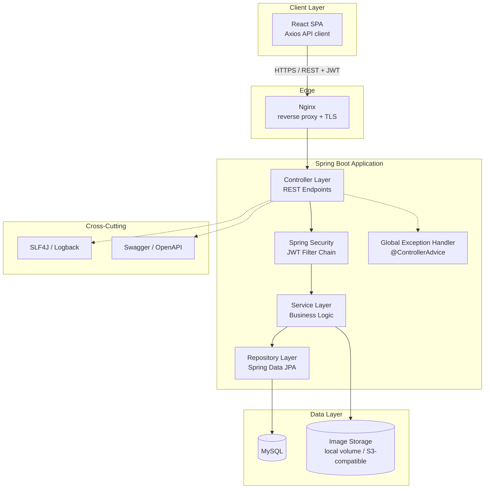
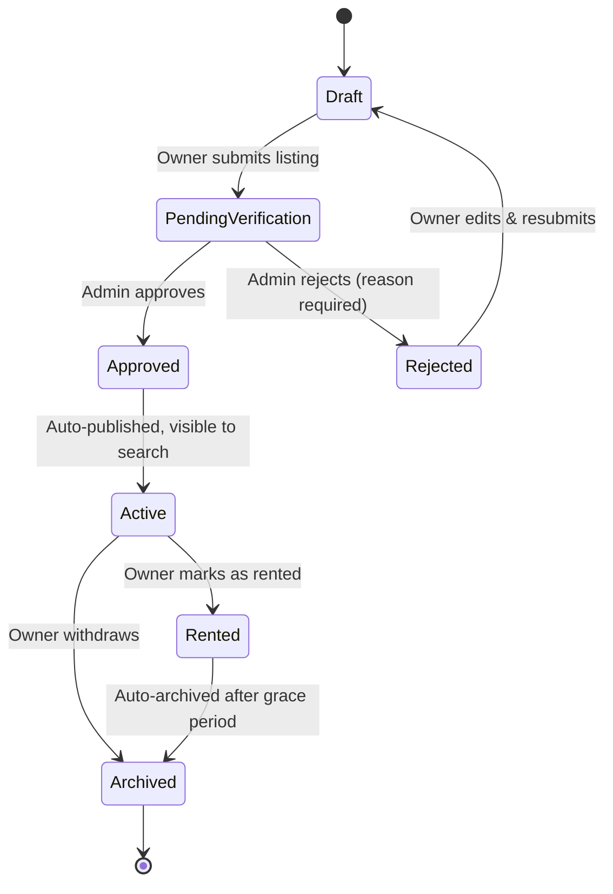
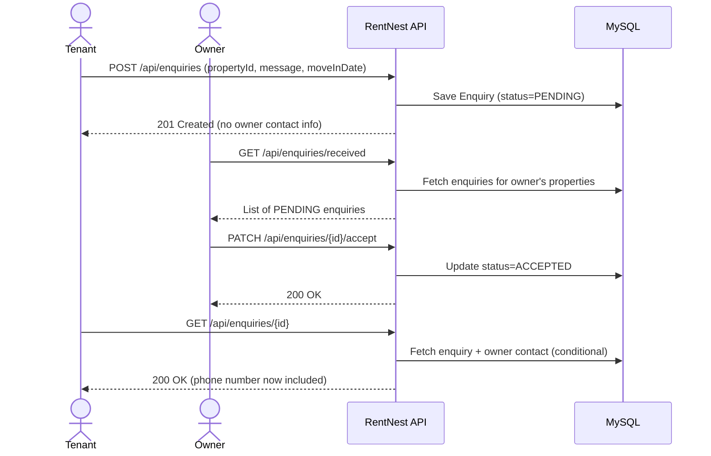
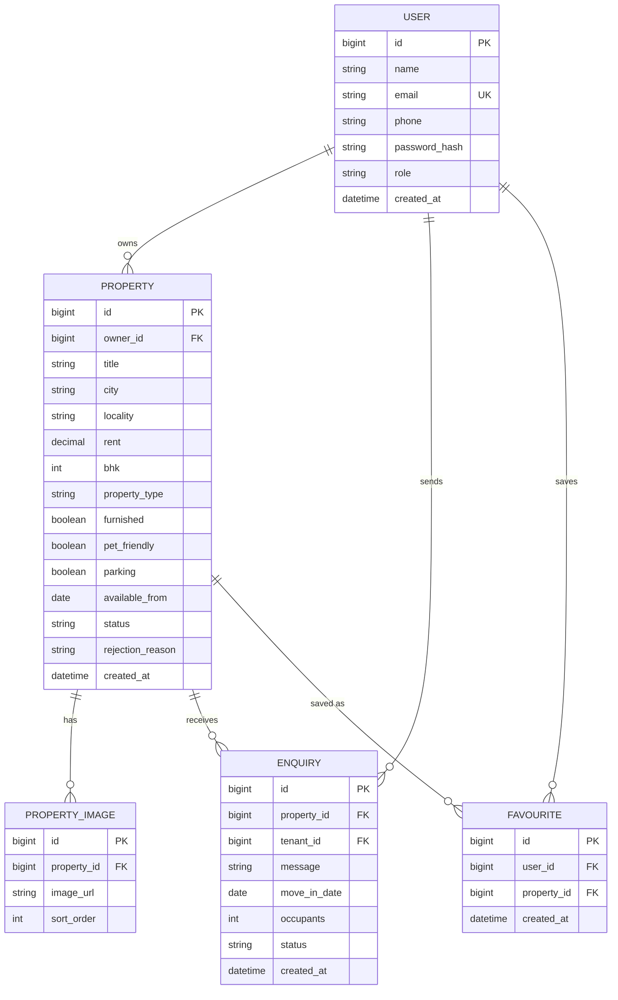

# RentNest — Privacy-First Rental Housing Platform

> **A full-stack rental housing web application for the Indian market** — where any user can list a property *and* search for one, using a single account, protected by a privacy-first enquiry workflow.

---

## Table of Contents

- [Overview](#overview)
- [Live Demo](#live-demo)
- [Core Features](#core-features)
- [Tech Stack](#tech-stack)
- [System Architecture](#system-architecture)
- [Property Lifecycle](#property-lifecycle)
- [Enquiry Workflow](#enquiry-workflow)
- [Database Schema](#database-schema)
- [Backend Structure](#backend-structure)
- [Frontend Structure](#frontend-structure)
- [Getting Started](#getting-started)
- [API Documentation](#api-documentation)
- [Running Tests](#running-tests)
- [Key Engineering Decisions](#key-engineering-decisions)

---

## Overview

RentNest replaces the fragmented experience of browsing multiple listing sites, dealing with brokers, and exposing personal contact details to strangers — with a **single, unified platform**.

The platform's defining idea is **privacy-first enquiry management**: contact details are never shown upfront. A tenant sends a structured enquiry, the owner reviews and accepts it, and only **then** is contact information exchanged — server-side, never broadcast to anonymous viewers.

A single user account acts as both **owner** (listing properties) and **tenant** (searching/enquiring), removing the need for dual registration. A separate `ROLE_ADMIN` account moderates the listing verification queue.

---

## Live Demo

> **Frontend:** `http://localhost:5173` (Vite dev server)  
> **Backend API:** `http://localhost:8080/api`  
> **Swagger UI:** `http://localhost:8080/swagger-ui.html`

**Demo Credentials**

| Role | Email | Password |
|---|---|---|
| User | `testuser@example.com` | `Password123!` |
| Admin | `admin@rentnest.com` | `AdminPassword123!` |

---

## Core Features

### 🏠 Property Listing (Owner Side)
- Create rich listings with title, city, locality, rent, BHK, furnishing, parking, pet-friendliness, and availability date
- Upload and reorder **multiple images** per listing with cover photo selection
- Full **property state machine**: Draft → Pending Verification → Active → Rented → Archived
- Edit, withdraw, or mark a property as rented at any time

### 🔍 Search & Discovery (Tenant Side)
- Filter by city, locality, min/max rent, BHK, property type, furnished, parking, pet-friendly, and availability date
- **Saved Favourites** — heart-icon toggle to save/unsave properties with a dedicated Saved Properties page
- Paginated results with sorting, backed by JPA Criteria API Specifications for composable, optional filters

### 📨 Privacy-First Enquiry Workflow
- Tenants submit structured enquiries (message, move-in date, occupant count) without seeing owner contact info
- Owners review Pending enquiries in a dedicated inbox and Accept or Decline
- Contact details are **only revealed server-side** once an enquiry is Accepted — never exposed in the listing

### 📊 Dashboards
- **Owner Dashboard:** Total listings, active count, total enquiries received, rented count
- **Tenant Dashboard:** Saved properties count, sent enquiries, recently viewed listings (tracked server-side via a dedicated `recently_viewed` table)

### 🔐 Admin Moderation
- Listings are not publicly searchable until an Admin approves them from the Pending Verification queue
- Admins can **Reject** with a mandatory reason (reason is surfaced to the owner for correction)
- Admins can **Deactivate** any Active listing that violates platform rules

### ✨ Editorial Design System
- Ellipsus-inspired editorial aesthetic — dark Ink hero, Fraunces serif headings, gold accent thread
- Animated SVG key motif on the search hero; hand-drawn SVG signature circles on the property detail modal
- Gold sliding underline navigation; hand-drawn floor-plan SVG watermarks on empty states

---

## Tech Stack

| Layer | Technology |
|---|---|
| **Frontend** | React 18 (Vite), Vanilla CSS, Axios |
| **Backend** | Java 21, Spring Boot 3.4, Spring MVC |
| **Security** | Spring Security, JWT (stateless), BCrypt |
| **Persistence** | Spring Data JPA (Hibernate), MySQL 8, Flyway migrations |
| **API Docs** | Swagger / OpenAPI 3 (springdoc-openapi) |
| **Testing** | JUnit 5, Mockito (62 backend tests) |
| **Build** | Maven (backend), npm + Vite (frontend) |
| **Tooling** | Git, GitHub, Postman |

---

## System Architecture



---

## Property Lifecycle

The property **state machine** is the architectural core — replacing a naive boolean `active` flag with explicit, enforced transitions:



A `RENTED` or `ARCHIVED` listing is automatically invisible to search and cannot receive new enquiries — enforced at the service layer, not just the UI.

---

## Enquiry Workflow

The privacy-first contact exchange is the product's key differentiator:



Owner contact details are **only assembled and returned** from the server when `enquiry.status == ACCEPTED` and the requesting user is the enquiry's tenant. Any other request gets a masked response.

---

## Database Schema



Schema is managed entirely through **Flyway versioned migrations** — no schema.create or DDL auto-update in production.

---

## Backend Structure

```
rentnest-backend/
├── src/main/java/com/rentnest/
│   ├── config/              # SecurityConfig, SwaggerConfig, CorsConfig, JwtConfig
│   ├── controller/          # AuthController, PropertyController, EnquiryController,
│   │                        # FavouriteController, DashboardController, AdminController
│   ├── service/             # Business logic + impl/ (concrete implementations)
│   ├── repository/          # JpaRepository + PropertySpecification (Criteria API)
│   ├── entity/              # JPA @Entity classes (User, Property, PropertyImage, Enquiry, Favourite)
│   ├── dto/
│   │   ├── request/         # Validated input DTOs (@Valid, @NotBlank, @Schema)
│   │   └── response/        # API response shapes (never expose raw entities)
│   ├── security/            # JwtAuthFilter, JwtTokenProvider, UserDetailsServiceImpl
│   ├── exception/           # GlobalExceptionHandler (@ControllerAdvice), custom exceptions
│   └── util/
├── src/main/resources/
│   ├── application.yml
│   └── db/migration/        # V1__init.sql ... V7__add_rejection_reason.sql
├── src/test/java/           # JUnit 5 + Mockito unit tests (62 tests, all passing)
└── pom.xml
```

**Rule enforced throughout:** Entities *never* cross the Controller layer — every request and response uses a DTO. Mapping happens in the Service layer.

---

## Frontend Structure

```
rentnest-frontend/
├── src/
│   ├── api/                 # axiosClient.js + per-domain API modules
│   │   ├── authApi.js
│   │   ├── propertyApi.js
│   │   ├── enquiriesApi.js
│   │   ├── favouritesApi.js
│   │   ├── dashboardApi.js
│   │   └── adminApi.js
│   ├── components/
│   │   ├── Header.jsx       # Unified nav bar (activeTab prop drives gold underline)
│   │   ├── property/        # PropertyDetailsModal, ImageUploader, PropertyCard
│   │   └── ui/
│   ├── pages/               # Dashboard, Search, MyListings, SavedListings,
│   │                        # SentEnquiries, ReceivedEnquiries, AdminReview,
│   │                        # CreateListing, EditListing, Login, Register
│   ├── hooks/               # useAuth
│   ├── context/             # AuthContext (JWT + user state)
│   └── styles/
│       ├── tokens.css       # CSS custom properties: --ink, --parchment, --gold-thread…
│       └── index.css        # Global styles, component classes, animation keyframes
└── package.json
```

---

## Getting Started

### Prerequisites

- Java 21+
- Spring Boot 3
- MySQL 8 running locally

### 1. Database Setup

```sql
CREATE DATABASE rentnest;
CREATE USER 'rentnest_app'@'localhost' IDENTIFIED BY 'change-me';
GRANT ALL PRIVILEGES ON rentnest.* TO 'rentnest_app'@'localhost';
FLUSH PRIVILEGES;
```

### 2. Backend

```bash
cd rentnest-backend
# Edit src/main/resources/application.yml with your DB credentials
mvn spring-boot:run
```

Flyway runs automatically on startup and applies all migrations. The admin account (`admin@rentnest.com`) is seeded on first boot.

### 3. Frontend

```bash
cd rentnest-frontend
npm install
npm run dev
```

Open `http://localhost:5173` in your browser.

---

## API Documentation

Full interactive API documentation is auto-generated by **springdoc-openapi**:

```
http://localhost:8080/swagger-ui.html
```

Every endpoint, request parameter, and response field is documented with descriptions, examples, and constraints using `@Operation`, `@Parameter`, and `@Schema` annotations.

**API surface summary:**

| Module | Endpoints |
|---|---|
| Auth | `POST /api/auth/register`, `POST /api/auth/login`, `GET /api/auth/me` |
| Properties | `POST/GET/PUT/DELETE /api/properties`, image upload, status transitions |
| Search | `GET /api/properties/search` (9 composable query filters, paginated) |
| Enquiries | `POST /api/enquiries`, `GET /received`, `GET /sent`, `PATCH /{id}/accept`, `PATCH /{id}/decline` |
| Favourites | `POST/DELETE /api/favourites/{propertyId}`, `GET /api/favourites` |
| Dashboards | `GET /api/dashboard/owner`, `GET /api/dashboard/tenant` |
| Admin | `GET /api/admin/pending`, `PATCH /api/admin/{id}/approve`, `PATCH /api/admin/{id}/reject`, `PATCH /api/admin/{id}/deactivate` |

---

## Running Tests

```bash
cd rentnest-backend
mvn test
```

**62 unit tests** covering:
- `AuthServiceTest` — registration validation, duplicate email, login/JWT
- `PropertyServiceTest` — state machine transitions, ownership checks, image constraints
- `EnquiryServiceTest` — submission rules, contact masking, accept/decline authorization
- `FavouriteServiceTest` — save/unsave idempotency
- `DashboardServiceTest` — aggregation queries
- `AdminServiceTest` — approve/reject/deactivate authorization
- `LocalStorageServiceImplTest` — MIME type validation, file extension checks, deletion

---

## Key Engineering Decisions

| Decision | Rationale |
|---|---|
| **Single `USER` role** (not separate Owner/Tenant) | Any user can list or search — avoids duplicate auth logic and matches the real-world behaviour where landlords also rent |
| **DTOs at every API boundary** | Prevents entity/lazy-loading leakage into JSON responses; keeps API contract stable independent of schema changes |
| **Specifications/Criteria API for search** | Filters are optional and composable (city + budget + BHK in any combination) — a fixed set of `findBy…` methods cannot scale to this |
| **Images stored as files, URL in DB** | Keeps the database small and fast; matches real-world practice and makes a future S3 migration trivial |
| **Stateless JWT (no server session)** | Enables horizontal scaling and a clean split between frontend and backend |
| **Property state machine** | Encodes real business rules (a rented property must not receive new enquiries) instead of a naive boolean `active` flag |
| **Flyway migrations** | Schema changes are versioned, auditable, and reproducible — `ddl-auto: validate` in production |
| **`@ControllerAdvice` global exception handler** | Centralises all error formatting; clients always receive a consistent `{status, message, timestamp}` shape |

---

## Project Documents

| Document | Purpose |
|---|---|
| [`Architecture.md`](./Architecture.md) | Full technical architecture, diagrams, folder structure |
| [`Design.md`](./Design.md) | Editorial design system, colour tokens, typography, component specs |
| [`PRD.md`](./PRD.md) | Product requirements, user personas, user stories |
| [`Phases.md`](./Phases.md) | Phase-by-phase development roadmap |
| [`Rules.md`](./Rules.md) | Engineering rules and conventions |
| [`memory.md`](./memory.md) | AI validation assistant context buffer and progress tracker |

---

<p align="center">Built with Java 21 · Spring Boot 3 · React 18 · MySQL 8</p>
